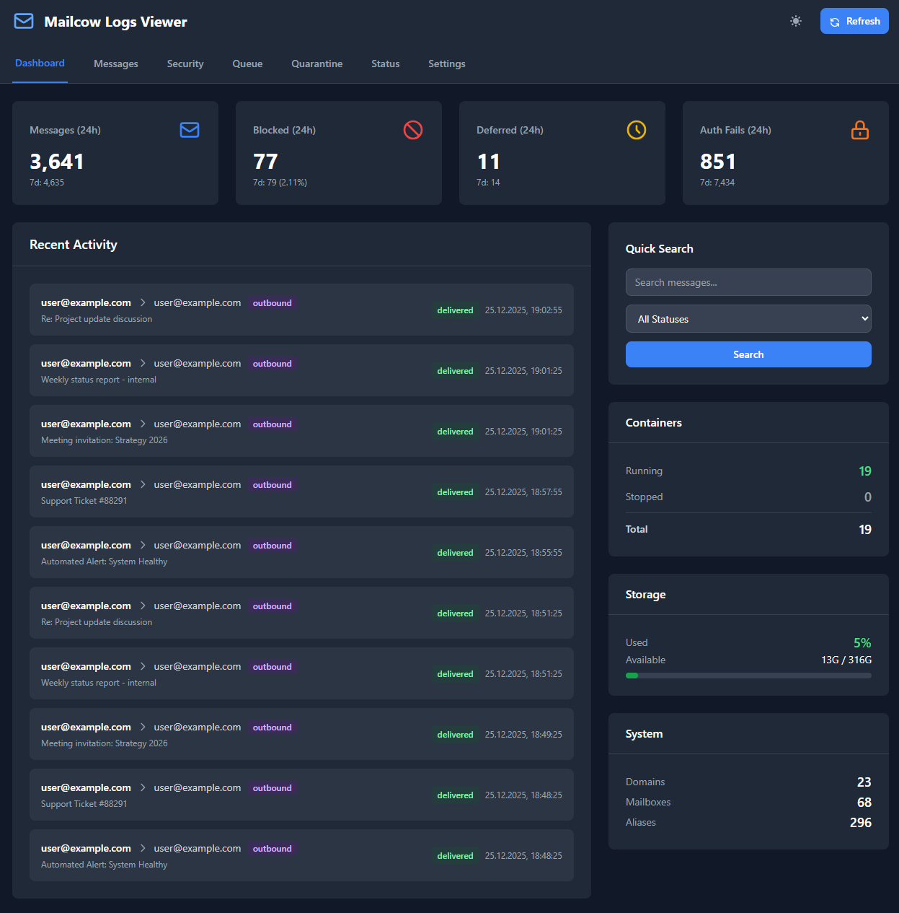
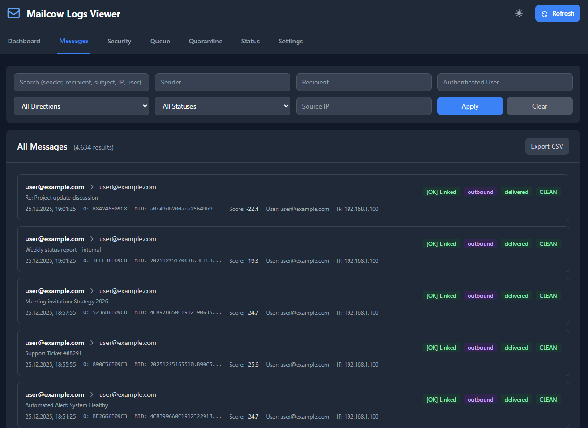
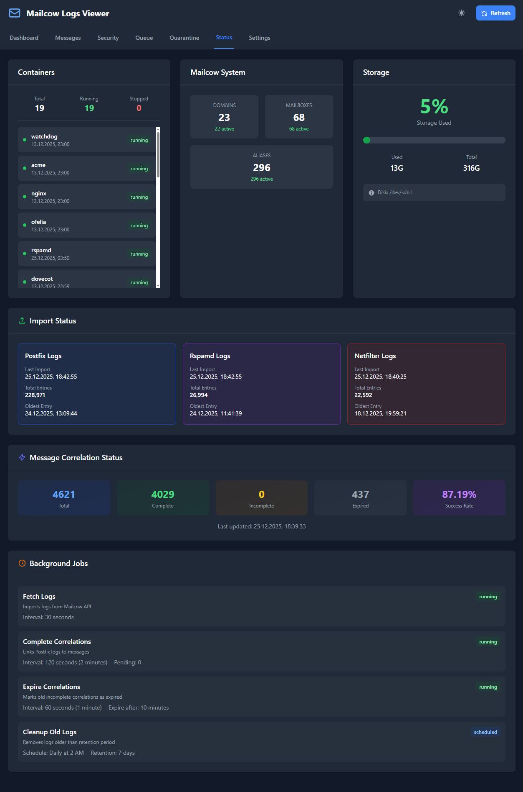

# Mailcow Logs Viewer

A modern, self-hosted dashboard for viewing and analyzing Mailcow mail server logs. Built for system administrators and technicians who need quick access to mail delivery status, spam analysis, and authentication failures.






---

## Features

### 📊 Dashboard
- Real-time statistics (24h / 7d / 30d)
- Messages, spam, failed deliveries, auth failures counts
- Container status overview
- Storage usage with visual indicator
- Quick search across all logs
- Recent activity stream

### 📬 Messages
- Unified view combining Postfix + Rspamd data
- Smart correlation linking related logs
- Multiple recipients display per email
- Inbound/Outbound direction detection
- Status tracking (delivered, bounced, deferred, expired, spam)
- Filter by sender, recipient, user, IP, direction
- Result count display
- CSV export

### 📋 Message Details Modal
- **Overview tab**: Message summary with all recipients
- **Logs tab**: Complete Postfix delivery timeline with error summary
- **Spam Analysis tab**: Full Rspamd symbols with scores and descriptions
- **Security tab**: Related Netfilter events for sender IP

### 🔒 Security (Netfilter)
- Failed authentication attempts
- Card-based UI with IP, username, method, action
- Attempt counts and timestamps
- 🔴 Visual indicator in tab when 24h activity exists
- Filter by IP, username, action

### 📮 Queue & Quarantine
- Real-time mail queue from Mailcow API
- Deferred messages with reasons
- Quarantined emails
- Search and filter

### 📈 Status
- All container states (running/stopped count)
- Storage usage with percentage bar
- System info (domains, mailboxes, aliases)
- Import status per log type
- Background jobs status
- Correlation completion rate
- Expired correlations counter

### ⚙️ Additional
- 🌙 Dark mode
- 📱 Responsive design
- 🔄 Auto-refresh
- 📥 CSV export for all log types
- 🚫 Email blacklist (hide specific addresses from display)
- 🧹 Automatic old log cleanup
- ⏰ Correlation expiration (marks old incomplete correlations)

---

## Quick Start

```bash
mkdir mailcow-logs-viewer && cd mailcow-logs-viewer

# Download docker-compose.yml and env.example
# Configure .env with your Mailcow details

docker compose up -d
# Open http://localhost:8080
```

📖 **Full installation guide:** [GETTING_STARTED.md](GETTING_STARTED.md)

---

## Architecture

| Component | Technology |
|-----------|------------|
| Backend | Python 3.11 + FastAPI |
| Database | PostgreSQL 15 |
| Frontend | HTML/JS + Tailwind CSS |
| Scheduler | APScheduler |

---

## Configuration

All settings via environment variables. See **[env.example](env.example)** for full reference.

### Required Settings

| Variable | Description |
|----------|-------------|
| `MAILCOW_URL` | Mailcow instance URL |
| `MAILCOW_API_KEY` | Mailcow API key |
| `MAILCOW_LOCAL_DOMAINS` | Your email domains |
| `POSTGRES_PASSWORD` | Database password |

### Key Optional Settings

| Variable | Default | Description |
|----------|---------|-------------|
| `FETCH_INTERVAL` | `60` | Seconds between log fetches |
| `FETCH_COUNT_POSTFIX` | `2000` | Postfix records per fetch |
| `FETCH_COUNT_RSPAMD` | `500` | Rspamd records per fetch |
| `RETENTION_DAYS` | `7` | Days to keep logs |
| `BLACKLIST_EMAILS` | (empty) | Emails to hide from display |
| `TZ` | `UTC` | Timezone |

---

## API

RESTful API for all functionality:

| Endpoint | Description |
|----------|-------------|
| `GET /api/health` | Health check |
| `GET /api/messages` | Unified messages with filters |
| `GET /api/message/{key}/details` | Full message details |
| `GET /api/logs/postfix` | Postfix logs |
| `GET /api/logs/rspamd` | Rspamd logs |
| `GET /api/logs/netfilter` | Netfilter logs |
| `GET /api/stats/dashboard` | Dashboard statistics |
| `GET /api/status/summary` | System status |
| `GET /api/export/{type}/csv` | CSV export |

📖 **Full API reference:** [API_DOCUMENTATION.md](API_DOCUMENTATION.md)

---

## Documentation

| Document | Description |
|----------|-------------|
| [GETTING_STARTED.md](GETTING_STARTED.md) | Installation guide |
| [API_DOCUMENTATION.md](API_DOCUMENTATION.md) | API reference |
| [CHANGELOG.md](CHANGELOG.md) | Version history |
| [env.example](env.example) | Configuration options |

---

## Requirements

- Docker & Docker Compose
- Mailcow with API access
- 512MB RAM minimum
- 1GB disk (varies with retention)

---

## License

MIT License

---

## Support

- **Logs**: `docker compose logs app`
- **Health**: `http://localhost:8080/api/health`
- **Issues**: Open issue on GitHub